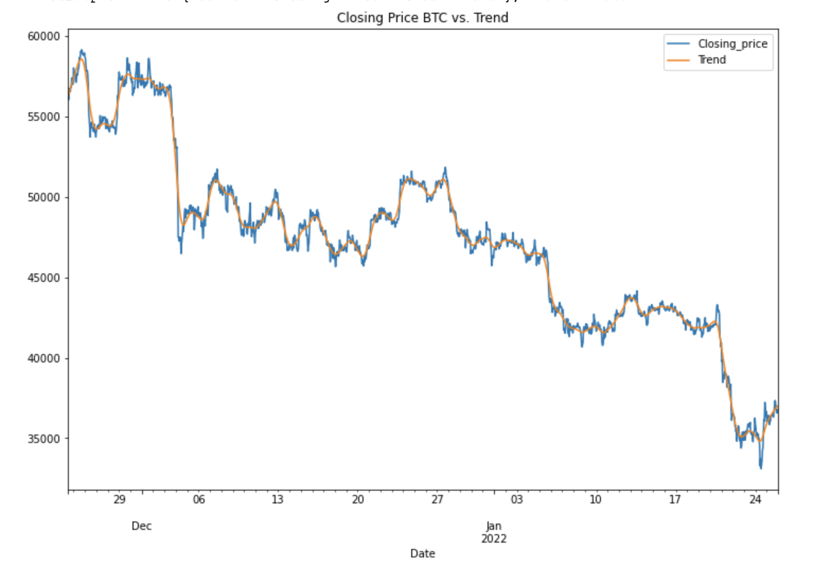
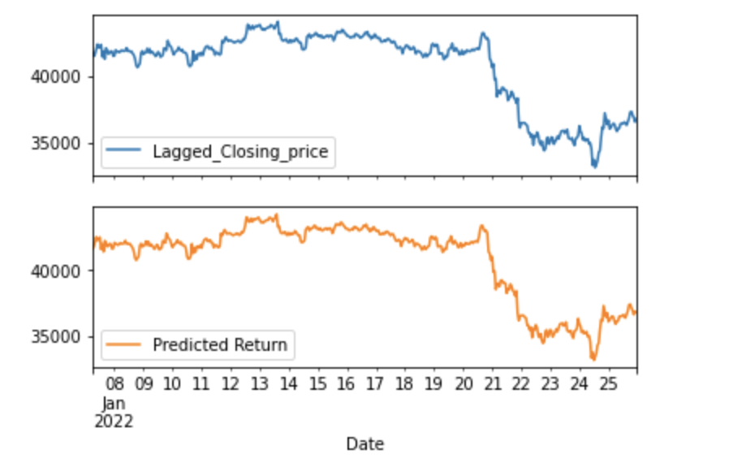
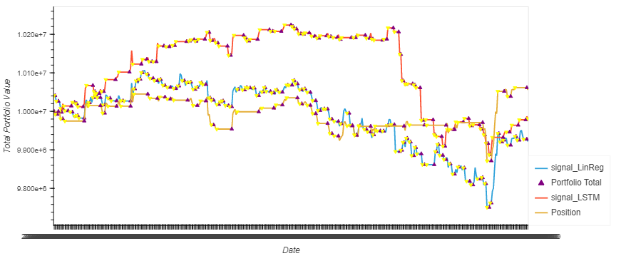
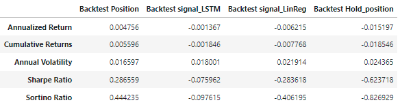
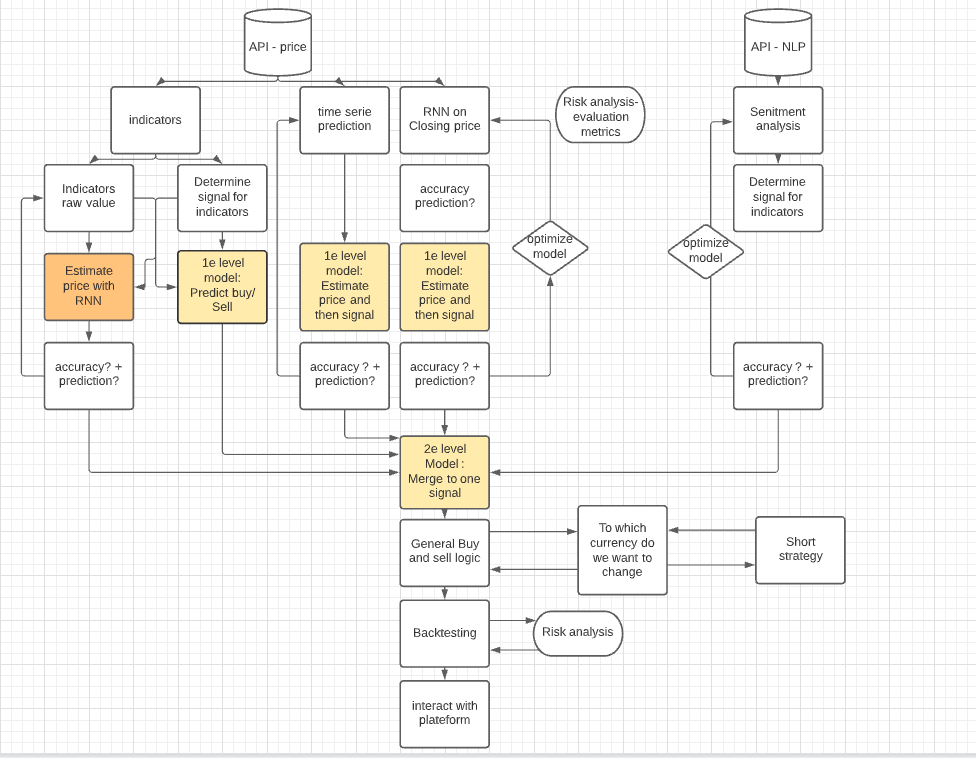

## Project Overview 

---

## Introduction
### Our Task 

We are a new team within an investment firm looking to enter the cryptocurrency space with an algorithmic trading package for our clients. Due to limited resources, management has tasked our team with building and testing Time Series and Neutral Network machine learning model to predict future prices and determine optimal times to buy and sell to maximize profits. After development of the model, it had to be evaluated to draw conclusions based on their performance. 

This analysis included the following steps:
1. Identify commonly traded cryptocurrencies with reliable data   
2. Create an Recurring Neural Network (RNN) in order to create a signal to trade on
3. Create a Regression Anlysis in order to create a signal to trade on
4. Merge signals from individual models to create a unique signal 
5. Backtest the merged signal model to see how it performs in compairson to the indvidual models

---

## Data Sources 
For this analysis, Bitcoin (BTC)  was chosen as the cryptocurrency for hte models. Hourly BTC data was pulled from the Kucoin API  at the follwoing link: https://api.kucoin.com/api/v1/market/candles?type={frequency}&symbol={ticker}-USDT&startAt={epoch}&endAt=0&limit=10000. 

---
## Data Analysis

### Part 1. Neural Network - LSTM Model 
Objective: Develop an LSTM model based off hourly BTC closing prices in order to make predictions that create a signal to trade on.

Location in Repository: DeepLearing_LSTM.ipynb

The steps for model development were as follows:

1. Imports 

2. API call to Kucoin Exchange 

3. Data cleaning 

4. Data preparation
    
    A. Prepare the training and testing data for the LSTM model.
   
    B. Use the window_data function to generate the X and y values for the model.
   
    C. Split the data into 70% training and 30% testing. Apply the MinMaxScaler to the X and y values.
    
    D. Reshape the X_train and X_test data for the model.

5. Build and Train the LSTM RNN

    A. Define the model architecture

    B. Compile the model

    C.Fit the model to the training data

6. Summarize the model

7. Evaluate Model Performance

8. Making Predictions using closing prices

9. Create a signal based on predictions
----

### Part 2. Anlysis of Time Series Regression
Objective: Develop a linear regression analysis in order to create a signal to trade on.

Location in Repository: TimeSerie_LinearRegression.ipynb

The steps for model development were as follows: 

1. Imports

2. API call to Kucoin Exchange 

3. Complete a Hodrick-Prescott Filter in order to filter out short-term fluctuations & decompose the time series into trend and non-trend componets 

4. Regression Analysis: Seasonal Effects with Sklearn Linear Regression
    
    A. Data Preparation
    
    B.Lagged Returns

    C.Train Test Split

    D.Linear Regression Model

5. Make predictions using the Testing Data

6. Out-of-Sample Performance

7. In-Sample Performance 

8. Create a Dataframe with hours as the index & predicted returns 

    A. Calculate the differnce between prior hour and current hour predicted returns 

9. Create a signal based on the difference in hourly predicted returns where a difference greater than or equal to zero is a buy and less that zero is a sell

----

## Part 3. Anlysis of Combined Porfolios

Objective: Merge signals from individual models to create a merged signal model with a unique signal

Location in Repository: PredictionsModels_n_Signal_BRK.ipynb

1. Imports 

2. Import testing data from previous regression and RNN LSTM models by reading in the csv files 

3. Load in the LSTM model via the pickle library, and recreate the predictions on the testing data

4. Load and predict Linear Regression model via the pickle library, and recreate the predictions on the testing data

5. Merge signals from different models to a unique signal by adding them together

    A. Merged signal: sell = 0, hold = 1,  and buy = 2

    B. Create a column with the difference (delta) of the merged signal. The first value of the delta column was hardcoded as 1 to provide the ability to buy if the signal advises this at the first time point.

    C. Create a buy/sell "switch" column which would tell the merged signal model whether it can buy or sell at each time point. No more than one buy or one sell can occur in direct succession. 

    D. Create the "Action" column to document the FINAL OUTPUT action (i.e., buy, sell, or hold) of the merged signal model.

6. Use a function to take in the final output signal of the merged signal model to minimize the number of buys & sells (i.e., once a buy happens. another buy can only occur after a sell occurs). The function consisted of the following parts for each time point (i.e. row in the DataFrame):

    A. Create buy and sell "switch" components to compare to the Action Switch in each row

    B. Set a variable for the "switch" that can be updated after each loop through the function to determine how the buy/sell "switch" should change. Initially set switch to 1 (i.e., buy) at the first time point because a buy must occur first after the start of the time series. Action Switch = 1 means "can buy", and Action Switch = 0 means "can sell."

    C. Run through various "if" statements based on the conditions to determine whether the action should be a buy (2), sell (0), or hold (1). Flip the "switch" as necessary, based on the action that occurs.

7. Plot the portfolio value of the merged signal model with that of the two individual models to compare performance.

    

----

## Part 4. Backtesting 

Location in Repository: Backtesting functions stored in "Backtesting.py", with analysis in in "PredictionsModels_n_Signal_BRK.ipynb"

Below are the steps to estabish and perform backtesting. 

1. Create Dataframe with Predicted Returns, Difference, and Singal

2. Calculate the Entry/Exit position 

3. Calculate evaluation metrics and add them to the dataframe 
    A. Set initial capital as $10,000,000. This was set very high to avoid situations where no captial remained due to potential losses from trades.

    B. Set the share size as 50 BTC.

    C. Multiply the close price by the number of shares held, or the Position

    D.Subtract the amount of either the cost or proceeds of the trade from the initial capital invested

    E. Calculate the total portfolio value by adding the portfolio cash to the portfolio holdings (or investments)

    F. Calculate the portfolio daily returns

    G. Calculate the portfolio cumulative returns

    H. Print to check Dataframe

4. Create a plot of the DataFrame to visualize the data using the following steps:

    A. Visualize exit position relative to total portfolio value

    B. Visualize entry position relative to total portfolio value

    C. Visualize the value of the total portfolio

    D. Overlay the plots

5. Create a dataframe of summary statistics 
    "Annualized Return",
    "Cumulative Returns",
    "Annual Volatility",
    "Sharpe Ratio",
    "Sortino Ratio"

6. Calculate annualized return

7. Calculate cumulative return

8. Calculate annual volatility

9. Calculate Sharpe ratio

10. Calculate Sortino ratio 

11. Summarized statistics 

    

12. Create an evaluation dataframe to evaluate the profit and loss of each transaction 
    
    A. Initialize trade evaluation DataFrame 
        "Currency",
        "Entry Date",
        "Exit Date",
        "Shares",
        "Entry Share Price",
        "Exit Share Price",
        "Entry Portfolio Holding",
        "Exit Portfolio Holding",
        "Profit/Loss"
    
    B. Loop through signal dataframe. 
    
    C. If Entry/Exit is 1, set entry trade metrics, but if the Entry/Exit is -1 then set exit trade metrics and calculate profit. 
    
    D. Append the record to the trade evaluation dataframe 

--- 

## Conclusions & Results 

### Test Results:

After merging the signals from the indiviual models we executed a model using an inital investment of $10,000,000 and a share size of 50. Here are our results:

* Annualized return (0.4%) and cumulative return (0.5%) of the combined signal model outperformed the individual Time Series Regression, LSTM model, and buy and hold position. Although the combined signal model outperformed the others, its returns are very low, without taking into account transaction costs.

* Annual Volatility of 1.67% resulted in the less volatility than the individual Time Series Regression, LSTM model, and buy and hold position.

* Sharpe ratio of 0.28 for the combined signal model resulted in a greater return in excess of the risk free rate than the indivual Time Serier Regression, LSTM models, and buy and hold position. 

* Sortino ratio of 0.44 resulted in a greater return when taking into account only the down side risk of our investment than the individual Time Series Regression, LSTM model, and buy and hold position.

Overall after analysing the back testing results, our recomendation is to not go to market with our combined signal model in its current state. Our results, while sufficent when compared to our individual models, does not result in enough confidence or overall return to provide great value to clients. Further development, tuning, and testing of the model is required in order to release teh product to our clients.

---

## Implications 
To improve model performance, we could look at the following options:

* Explore the use of indicators to better refine our models. 
* Incorporate weights in the calculations of the signals. 
* Use different metrics for determining the signals.
* Explore using less volitile assets such as stocks or bonds. 
* Explore ways to change the amount bought/sold in each transaction. 
* Use a larger data set.
* Use daily closing prices instead of hourly. Hourly data was used in this case ilter out the volatility in the 2020 data.

A potential future state of the model, incorporating indicators and natural language processing, could be as shown below.

